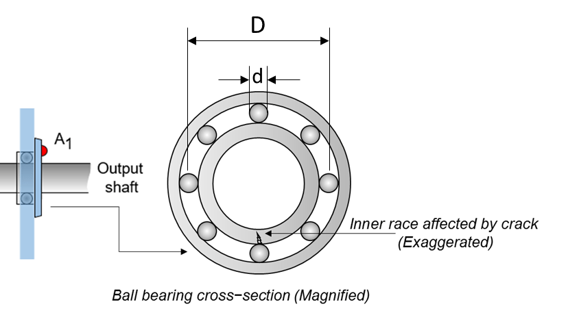

# Diagnóstico de Falhas em Rolamentos de Elementos Rolantes



Este repositório implementa o diagnóstico de falhas em rolamentos usando abordagens de processamento clássico de sinais e aprendizado profundo baseado nos tutoriais da MathWorks.

## Estrutura do Projeto

```
bearing_fault_diagnosis/
├── data/                           # Conjuntos de dados brutos e processados
├── scripts/                        # Scripts de implementação
│   ├── 01_data_preprocessing/      # Carregamento e preparação de dados
│   ├── 02_signal_processing/       # Análise e filtragem de sinais
│   ├── 03_feature_extraction/      # Cálculo de características
│   ├── 04_classical_ml/           # Abordagens tradicionais de ML
│   └── 05_deep_learning/          # Implementações de redes neurais
├── functions/                      # Funções reutilizáveis do MATLAB
├── results/                        # Resultados e gráficos de saída
│   ├── classical_approach/        # Resultados do processamento de sinais
│   └── deep_learning_approach/    # Resultados do aprendizado profundo
└── docs/                          # Documentação
```

## Ordem de Implementação

### Fase 1: Abordagem de Processamento Clássico de Sinais
1. **Pré-processamento de Dados** (`01_data_preprocessing/`)
   - Carregar conjunto de dados MFPT
   - Extrair parâmetros do rolamento (BPFO, BPFI, FTF, BSF)
   
2. **Processamento de Sinais** (`02_signal_processing/`)
   - Análise do espectro envoltório
   - Implementação do kurtograma
   - Filtragem passa-banda

3. **Extração de Características** (`03_feature_extraction/`)
   - Calcular amplitudes do espectro envoltório
   - Computar razões de amplitude BPFI/BPFO
   - Extrair características de curtose

4. **Classificação** (`04_classical_ml/`)
   - Implementação de classificador baseado em regras
   - Detecção de falhas baseada em limiar

### Fase 2: Abordagem de Aprendizado Profundo
1. **Pré-processamento de Dados** (`01_data_preprocessing/`)
   - Converter sinais 1D para escalogramas 2D
   - Implementação de transformada wavelet
   - Redimensionar imagens para 227x227x3

2. **Aprendizado Profundo** (`05_deep_learning/`)
   - Aprendizado por transferência com SqueezeNet
   - Configuração de treinamento
   - Avaliação do modelo

## Começando

1. Execute os scripts em ordem numérica dentro de cada fase
2. Scripts da abordagem clássica: `01_` → `02_` → `03_` → `04_`
3. Scripts de aprendizado profundo: `01_` → `05_`

## Dependências
- MATLAB Predictive Maintenance Toolbox
- Deep Learning Toolbox
- Signal Processing Toolbox
- Wavelet Toolbox

## Sobre o Projeto

Este projeto é baseado nos seguintes tutoriais da MathWorks:
- [Diagnóstico de Falhas em Rolamentos de Elementos Rolantes](https://www.mathworks.com/help/predmaint/ug/Rolling-Element-Bearing-Fault-Diagnosis.html)
- [Diagnóstico de Falhas em Rolamentos usando Aprendizado Profundo](https://www.mathworks.com/help/predmaint/ug/rolling-element-bearing-fault-diagnosis-using-deep-learning.html)

O sistema implementa duas metodologias complementares para detectar e classificar falhas em rolamentos industriais, fornecendo tanto análise tradicional baseada em características quanto classificação automática por redes neurais.